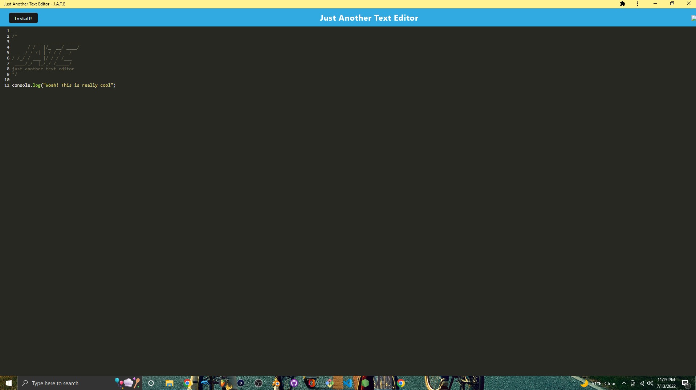
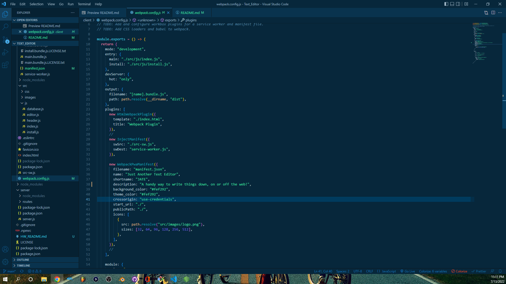

# J.A.T.E (A PWA Primer)




## Description

Why did you decide to build this project?

```
In this exercise, I want to be able to deploy my program as a Progressive Web Application; allowing the user to employ CRUD routes and manipulate data either on or off the network.
```

## Table of Contents

- [Installation](#installation)
- [Usage](#usage)
- [Contributing](#contributing)
- [Tests](#tests)
- [Questions](#questions)

## Installation

How to install:

```
To install the repository;
  - Simply go to the repository website and hit the green button at the top, labeled "code"
  - Copy the SSH link, and go to your locale machine's directory
  - Direct yourself to where you would like the project to be stored, and type "git clone <copy the link here>", and press enter
Congrats! you have installed the repository to your local machine!
```

This program can also be installable through the [Heroku](https://loggamons-text-editor.herokuapp.com/) app.

```
To install the app though Heroku;
	- Simply click the 'install' button at the top of the page, and accept the incoming changes.
Congrats! You have installed the app to your desktop!
```

## Usage

How does your project work?

```
This program makes use of the idb plugin, allowing users to manipulate data without the use of internet.
This is the the PUT method for the application. Note that rather than using CRUD routes to other pages in the browser, it actually accesses the indexDB directly, and updates it, then saving it to the indexDB under the same key.

export const putDb = async (content) => {
  console.log("PUT to the db!");
  const jateDb = await openDB("jate", 1);
  const tx = jateDb.transaction("jate", "readwrite");
  const store = tx.objectStore("jate");
  const request = store.put({ id: 1, text: content });
  const result = await request;
  console.log("Woo! Added to the database!", result);
};
```

## Contributing

How can you contribute to this project?

```
I love feedback! Please let me know if there's any tips or tricks i could do to slim down any code, or fix any redundancies if you see any.
You can reach me through the links below!
```

## Tests

To run this program:

```
One of the important aspects of the program is its bundling protocal. To do this, we're using Webpack!
To make sure it bundles properly, we need to set some rules;

module: {
      rules: [
        {
          test: /\.css$/i,
          use: ["style-loader", "css-loader"],
        },
        {
          test: /\.(png|svg|jpg|jpeg|gif)$/i,
          type: "asset/resource",
        },
        {
          test: /\.m?js$/,
          exclude: /(node_modules|bower_components)/,
          use: {
            loader: "babel-loader",
            options: {
              presets: ["@babel/preset-env"],
            },
          },
        },
      ],
    },

Using regexes for tests will allow us to run certain loaders on files, based on what type of files they are (css, images, js)!
```



## Questions

If you have any questions, you can contact me through:

- [Github](https://github.com/Loggamon)
- Email: scarletfedora@gmail.com

## License & Copyright

© Logan Monson
